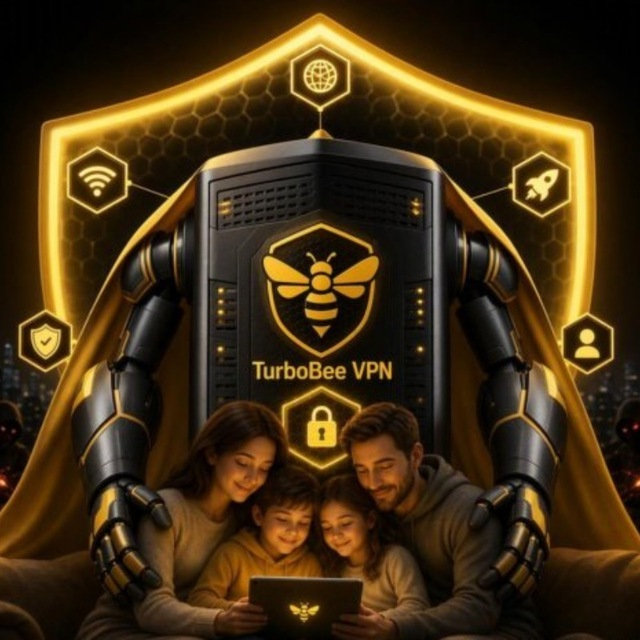

# TurboBee VPN

<p align="center">
  
</p>

**TurboBee VPN** — быстрый VPN-клиент на протоколе VLESS с поддержкой ссылок-подписок. Без регистрации, без рекламы, без аналитики.

| Платформа | Скачать | Требования |
|---|---|---|
| **Android** | [TurboBeeVPN.apk](https://github.com/whisa777/TurboBeeVPN/raw/main/TurboBeeVPN.apk) — 20 МБ | Android 7.0+, ARM64 |
| **Android (универсальная)** | [TurboBeeVPN-universal.apk](https://github.com/whisa777/TurboBeeVPN/releases/download/latest-build/TurboBeeVPN-universal.apk) — 57 МБ | Android 7.0+, любая архитектура |
| **Windows** | [TurboBeeVPN.exe](https://github.com/whisa777/TurboBeeVPN/raw/main/TurboBeeVPN.exe) — 28 МБ | Windows 10/11 x64, права администратора |

## Возможности

- **Протокол VLESS** — ws / tcp / gRPC, TLS и Reality
- **Ссылки-подписки** (`http/https`) — вставляете одну ссылку, все серверы добавляются автоматически; при обновлении списка достаточно добавить подписку заново
- **Раздельная маршрутизация** — российские сайты (банки, Госуслуги, Авито и т.д.) ходят напрямую, минуя VPN
- **Защита от блокировок DNS** — Яндекс-DNS первым в цепочке + IPv6 внутри туннеля: RU-сайты открываются даже при включённом VPN
- **Статистика трафика** за сессию (Windows)
- **RU/EN интерфейс**, светлая и тёмная темы

## Установка

### Android

1. Скачайте `TurboBeeVPN.apk` по ссылке выше
2. Откройте файл и разрешите установку из неизвестных источников
3. Если Google Play Protect предупреждает о неизвестном приложении — нажмите «Все равно установить» (приложение не из Play Market, поэтому стандартное предупреждение)
4. Добавьте ключ или подписку через кнопку «+»

> Если загрузка зависла на 99% в Chrome — нажмите на загрузку → пауза → продолжить, либо скачайте через другой браузер.

### Windows

1. Скачайте `TurboBeeVPN.exe`
2. Запустите от имени администратора (для TUN-туннеля нужны права администратора)
3. Добавьте ключ или подписку через «+ Добавить ключ»
4. Нажмите кнопку подключения

## Как добавить ключ

Приложение понимает два формата:

**1. VLESS-ссылка** (один сервер):

```
vless://UUID@host:port?path=...&type=ws&security=tls#Имя
```

**2. Ссылка-подписка** (`http://` или `https://`) — сервер отдаёт список vless-ссылок (обычно в base64). Вставьте её так же, как обычную ссылку — приложение скачает список и добавит все серверы сразу.

## Маршрутизация

По умолчанию включён обход VPN для российских ресурсов: сайты из встроенного белого списка (Сбербанк, Госуслуги, ВК, Ozon и др.) открываются напрямую. Это можно отключить в настройках («Обходить VPN для российских сайтов»).

## Частые вопросы

**VPN подключается, но интернет не работает?**
Проверьте срок действия ключа. На бесплатных тарифах ключ мог истечь.

**Безопасно ли это?**
Приложение не собирает аналитику и не отправляет данные на наши серверы. Единственный исходящий служебный запрос — ваша ссылка-подписка (к тому серверу, который выдал вам ключ).

**Почему EXE просит права администратора?**
Для создания системного TUN-туннеля в Windows требуются повышенные права. Это стандартное требование всех VPN-клиентов.

## Обратная связь

Нашли баг или нужна помощь — напишите тому, кто выдал вам ключ.
